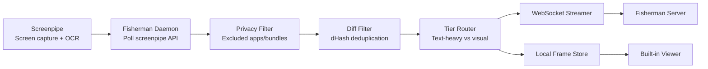

# Fisherman

Lightweight macOS screen streamer. Uses Screenpipe for capture and OCR, then streams frames to your server over WebSocket. Runs as a dynamic notch app.

## Quick Start

```bash
curl -fsSL https://raw.githubusercontent.com/sxysun/fisherman/main/install.sh | bash
```

This installs everything (uv, screenpipe, Python deps), prompts for your server URL and auth token, builds the menu bar app, and deploys to `/Applications`.

Then:

```bash
open /Applications/Fisherman.app
```

The app appears in the notch area. Green = streaming. It manages screenpipe and the fisherman daemon as child processes.

## New User Setup

### 1. Deploy the server

```bash
cd server
bash setup.sh        # auto-generates encryption keys and auth token, installs deps
docker compose up    # starts Postgres + ingest server on port 9999
```

No external database or cloud storage needed to get started — Postgres runs in Docker and frames are stored locally. Copy the auth token printed by `setup.sh` for the next step. See [`server/README.md`](server/README.md) for production setup with R2.

### 2. Install the client (macOS)

```bash
curl -fsSL https://raw.githubusercontent.com/sxysun/fisherman/main/install.sh | bash
```

### 3. Configure

Open Fisherman.app, hover over the notch, and click **Settings**. Set your server URL (e.g. `ws://your-server:9999/ingest`) and auth token. The daemon restarts automatically when you save.

You can also edit `~/.fisherman/.env` directly — see the Configuration section below.

## What It Does

1. **Screenpipe** captures your screen and runs OCR locally
2. **Fisherman** polls screenpipe for new frames, applies privacy filters and deduplication, then streams to your server over WebSocket
3. Frames are also saved locally at `~/.fisherman/frames/` with a built-in viewer

## Configuration

All config is via environment variables or `~/.fisherman/.env`, prefixed with `FISH_`.

### Essential

| Variable | Default | Description |
|---|---|---|
| `FISH_SERVER_URL` | `ws://localhost:9999/ingest` | WebSocket server URL |
| `FISH_AUTH_TOKEN` | (empty) | Bearer token for server auth |

### Advanced

<details>
<summary>All options</summary>

| Variable | Default | Description |
|---|---|---|
| `FISH_CAPTURE_BACKEND` | `screenpipe` | Capture backend (`screenpipe` or `native`) |
| `FISH_SCREENPIPE_URL` | `http://127.0.0.1:3030` | Screenpipe local API |
| `FISH_SCREENPIPE_POLL_INTERVAL` | `5.0` | Seconds between screenpipe polls |
| `FISH_SCREENPIPE_SEARCH_LIMIT` | `50` | OCR records per poll |
| `FISH_DIFF_THRESHOLD` | `6` | dHash distance below which frames are skipped |
| `FISH_JPEG_QUALITY` | `60` | JPEG compression quality (0-100) |
| `FISH_MAX_DIMENSION` | `1920` | Max width/height for frames |
| `FISH_CONTROL_PORT` | `7892` | Local HTTP port for CLI control |
| `FISH_EXCLUDED_BUNDLES` | `[]` | Bundle IDs to never capture |
| `FISH_EXCLUDED_APPS` | `[]` | App names to never capture |
| `FISH_FRAMES_DIR` | `~/.fisherman/frames` | Local frame storage |
| `FISH_LOCAL_FRAMES_MAX` | `1000` | Max locally stored frames |
| `FISH_VLM_ENABLED` | `false` | Enable local VLM scene understanding |
| `FISH_VLM_INTERVAL` | `10.0` | Seconds between VLM runs |

</details>

## CLI

```
fisherman start              # start the daemon
fisherman start --daemon     # start in background
fisherman status             # show daemon status
fisherman pause              # pause capture
fisherman resume             # resume capture
fisherman stop               # stop the daemon
fisherman install-service    # install macOS LaunchAgent for auto-start
```

## Architecture



## Local Frame Viewer

Captured frames are saved at `~/.fisherman/frames/`. View them at `http://127.0.0.1:7892/viewer` or via **View Frames...** in the app menu.

## Server

`cd server && bash setup.sh && docker compose up` — see [`server/README.md`](server/README.md) for details and production deployment with Cloudflare R2.

## Uninstall

```bash
curl -fsSL https://raw.githubusercontent.com/sxysun/fisherman/main/uninstall.sh | bash
```

Or manually: delete `/Applications/Fisherman.app` and `~/.fisherman`.

## Troubleshooting

**Screenpipe not running**: The app starts screenpipe automatically. If it fails, install manually with `brew install screenpipe` and ensure it has Screen Recording permission in System Settings > Privacy & Security.

**Port already in use**: If the daemon can't bind, check for a stale process:
```bash
lsof -ti tcp:7892 | xargs kill
```

**Server unreachable**: The daemon logs `server_unreachable` when it can't connect. Frames are still saved locally. Check `FISH_SERVER_URL` in `~/.fisherman/.env`.

**App won't open after rebuild**: Strip quarantine attributes: `xattr -cr /Applications/Fisherman.app`

## Requirements

- macOS 13+
- Python 3.12+
- Screenpipe (`brew install screenpipe`)
