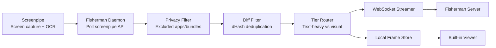

# Fisherman

Lightweight macOS screen streamer. Uses Screenpipe for capture and OCR, then streams frames to your server over WebSocket. Runs as a dynamic notch app.

## Quick Start

Fisherman has two sides:
- client: the macOS app that captures and streams frames
- server: the ingest service that receives, encrypts, and stores them

Recommended setup:
- end users install a prebuilt client app if you provide one
- server operators use an agent-managed server setup or the manual server quick start

### One-line agent setup

If you already have Hermes / OpenCode / another shell-capable agent on the server, point it at this repo and give it the prompt in:
- `skills/server-agent-setup-prompt.md`

If you prefer a shell entrypoint for the agent, it can also run:

```bash
cd server
bash bootstrap-agent.sh --start
```

That will run setup, print the client auth token, and start the ingest server in the background.

## New User Setup

### 1. Set up the server

Recommended for technical users: have an agent handle it.
See `server/README.md` and `skills/` for the agent-managed flow.

Manual quick start:

```bash
cd server
bash setup.sh
uv run python ingest.py
```

This creates `.env`, installs dependencies, sets up Postgres, generates an encryption key, and generates an ingest auth token.

Important auth note:
- the client auth token is just a shared bearer password
- `setup.sh` auto-generates one for convenience
- you can also open `server/.env` and set `INGEST_AUTH_TOKEN` yourself to any strong random value you want
- the client should use the same value as `FISH_AUTH_TOKEN`

No external database or cloud storage is required to get started. Local Postgres + local frame storage works by default. See [`server/README.md`](server/README.md) for production options, agent setup, and R2.

### 2. Install the client (macOS)

#### Option A — prebuilt app / DMG (recommended)

Recommended distribution model:
- publish a `Fisherman.app`, `.zip`, or `.dmg` via GitHub Releases or your own download page
- send users directly to that artifact instead of asking them to compile locally
- this repo now includes a GitHub Actions workflow at `.github/workflows/macos-release.yml` that can build `.zip` and `.dmg` artifacts for tagged releases or manual runs
- for the smoothest end-user install experience, you will eventually want Apple signing/notarization credentials; without that, the app is still distributable but macOS may show extra warnings/quarantine friction

If you provide a precompiled Fisherman.app or DMG to the user:
1. drag `Fisherman.app` into `/Applications`
2. open the app
3. grant Screen Recording / related macOS permissions
4. paste the server URL and auth token

#### Option B — build/install from source (advanced)

```bash
curl -fsSL https://raw.githubusercontent.com/sxysun/fisherman/main/install.sh | bash
```

This installs dependencies, prompts for server URL + auth token, builds the menu bar app locally, and deploys it to `/Applications`.

### 3. Configure the client

**Quickest:** paste the setup code from the server into Fisherman's **Quick Setup** field. The server prints a one-line code like `fish:eyJ1cmw...` when you run `bootstrap-agent.sh`. Paste it and click **Connect** — done.

**Manual:** hover over the notch, click **Settings**, and enter:
- server URL (for example `ws://your-server:9999/ingest` or `wss://your-server/ingest`)
- auth token (the same shared token / password as `INGEST_AUTH_TOKEN` on the server)

The daemon restarts automatically when you save. On first launch with no server configured, the settings window opens automatically.

You can also edit `~/.fisherman/.env` directly — see the Configuration section below.

## What It Does

1. **Screenpipe** captures your screen and runs OCR locally
2. **Fisherman** polls screenpipe for new frames, applies privacy filters and deduplication, then streams to your server over WebSocket
3. Frames are also saved locally at `~/.fisherman/frames/` with a built-in viewer

## Configuration

All config is via environment variables or `~/.fisherman/.env`, prefixed with `FISH_`.

### Essential

| Variable | Default | Description |
|---|---|---|
| `FISH_SERVER_URL` | `ws://localhost:9999/ingest` | WebSocket server URL |
| `FISH_AUTH_TOKEN` | (empty) | Bearer token for server auth |

### Advanced

<details>
<summary>All options</summary>

| Variable | Default | Description |
|---|---|---|
| `FISH_CAPTURE_BACKEND` | `screenpipe` | Capture backend (`screenpipe` or `native`) |
| `FISH_SCREENPIPE_URL` | `http://127.0.0.1:3030` | Screenpipe local API |
| `FISH_SCREENPIPE_POLL_INTERVAL` | `3.0` | Seconds between screenpipe polls |
| `FISH_SCREENPIPE_SEARCH_LIMIT` | `50` | OCR records per poll |
| `FISH_DIFF_THRESHOLD` | `3` | dHash distance below which frames are skipped |
| `FISH_JPEG_QUALITY` | `60` | JPEG compression quality (0-100) |
| `FISH_MAX_DIMENSION` | `1920` | Max width/height for frames |
| `FISH_CONTROL_PORT` | `7892` | Local HTTP port for CLI control |
| `FISH_EXCLUDED_BUNDLES` | `[]` | Bundle IDs to never capture |
| `FISH_EXCLUDED_APPS` | `[]` | App names to never capture |
| `FISH_FRAMES_DIR` | `~/.fisherman/frames` | Local frame storage |
| `FISH_LOCAL_FRAMES_MAX` | `1000` | Max locally stored frames |

</details>

## CLI

```
fisherman start              # start the daemon
fisherman start --daemon     # start in background
fisherman status             # show daemon status
fisherman pause              # pause capture
fisherman resume             # resume capture
fisherman stop               # stop the daemon
fisherman install-service    # install macOS LaunchAgent for auto-start
```

## Architecture



## Local Frame Viewer

Captured frames are saved at `~/.fisherman/frames/`. View them at `http://127.0.0.1:7892/viewer` or via **View Frames...** in the app menu.

## Server

`cd server && bash setup.sh && docker compose up` — see [`server/README.md`](server/README.md) for details and production deployment with Cloudflare R2.

## Fisherman CLI — Agent Integration

The fisherman CLI lets AI agents query what the user has been doing — recent apps, OCR text, window titles, URLs, and screenshots. All data is encrypted at rest and decrypted on the fly by the CLI.

### Setup

The CLI runs from the `server/` directory and requires two things in `server/.env`:
- `DATABASE_URL` — Postgres connection string (set by `setup.sh`)
- `ENCRYPTION_KEY` — Fernet key for decryption (set by `setup.sh`)

If you ran `bash setup.sh` during server setup, both are already configured.

```bash
cd server
uv sync   # install deps (one-time)
```

### Commands

```bash
# Recent activity as JSON (best for agents)
uv run fisherman query -j --limit 20

# Search across all captured OCR text, window titles, and descriptions
uv run fisherman query -j --search "meeting notes"

# Filter by app and time range
uv run fisherman query -j --app "Chrome" --since "2h ago"
uv run fisherman query -j --app "VSCode" --since "2026-04-01T09:00:00"

# Activity summary grouped by app (good for "what have I been doing?")
uv run fisherman summary --since "4h ago"

# Full detail for a specific frame
uv run fisherman show <frame_id>

# Decrypt and save a screenshot
uv run fisherman image "<image_key>" -o /tmp/screenshot.jpg
```

### Output format (JSON mode)

Each frame in `-j` mode returns:

```json
{
  "id": 42,
  "ts": "2026-04-01T17:34:20+00:00",
  "app": "Chrome",
  "window": "GitHub - Pull Request #123",
  "ocr_text": "Full OCR text from the screen...",
  "urls": ["https://github.com/..."],
  "image_key": "frames/2026-04-01/1234567890.jpg.enc",
  "width": 1920,
  "height": 1080,
  "tier_hint": 2
}
```

The `image_key` can be passed to `uv run fisherman image "<image_key>"` to retrieve the actual screenshot.

### Agent CLAUDE.md snippet

Add this to your project's `CLAUDE.md` so your agent knows how to use fisherman:

```markdown
## User context (fisherman)

To understand what the user has been doing on their computer:

\`\`\`bash
cd /path/to/fisherman/server
uv run fisherman query -j --limit 20              # recent screen captures
uv run fisherman query -j --search "keyword"       # search all OCR text
uv run fisherman summary --since "2h ago"           # activity by app
\`\`\`

Returns decrypted OCR text, window titles, URLs, and app names from screen captures.
```

## Repo-local skill docs

Workflow-specific skill mirrors live in:
- `skills/fisherman-cli/` — instructions for querying and visually inspecting Fisherman data reliably
- `skills/mind-rolling-summary/` — instructions/templates for turning Fisherman evidence into layered memory under `/home/ubuntu/mind`
- `skills/server-agent-setup-prompt.md` — a copy-paste prompt for asking an agent to handle the server side end-to-end

These mirror the live Hermes skills so the workflow is discoverable inside this repo too.

## Release automation

- `.github/workflows/macos-release.yml` builds `Fisherman.app`, `.zip`, and `.dmg` artifacts on macOS runners
- run it manually from GitHub Actions or push a tag like `v0.1.0` to publish release artifacts
- current workflow uses ad-hoc signing for distributable artifacts
- if you want first-class macOS install UX, the next step is adding Apple Developer signing + notarization secrets and extending the workflow

## Uninstall

```bash
curl -fsSL https://raw.githubusercontent.com/sxysun/fisherman/main/uninstall.sh | bash
```

Or manually: delete `/Applications/Fisherman.app` and `~/.fisherman`.

## Troubleshooting

**Screenpipe not running**: The app starts screenpipe automatically. If it fails, install manually with `brew install screenpipe` and ensure it has Screen Recording permission in System Settings > Privacy & Security.

**Port already in use**: If the daemon can't bind, check for a stale process:
```bash
lsof -ti tcp:7892 | xargs kill
```

**Server unreachable**: The daemon logs `server_unreachable` when it can't connect. Frames are still saved locally. Check `FISH_SERVER_URL` in `~/.fisherman/.env`.

**App won't open after rebuild**: Strip quarantine attributes: `xattr -cr /Applications/Fisherman.app`

## Requirements

- macOS 13+
- Python 3.12+
- Screenpipe (`brew install screenpipe`)
